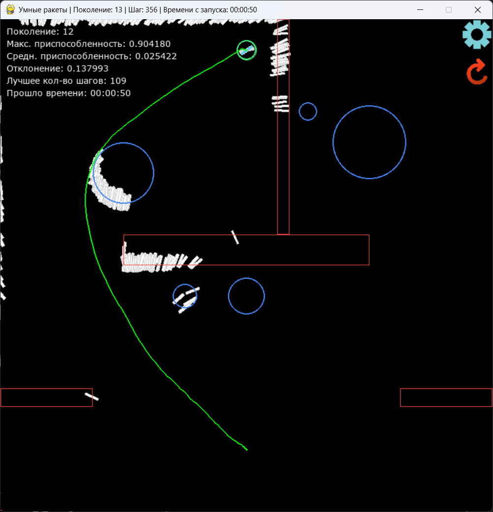

# Smart Rockets

[](https://github.com/mickylangello/SmartRocketsGrav/actions)
[](https://mickylangello.github.io/SmartRocketsGrav/)


[](https://opensource.org/licenses/MIT)

Симуляция эволюционного поведения на основе генетического алгоритма. В этом проекте "умные ракеты" учатся находить оптимальный путь к цели, огибая статические препятствия и адаптируясь к гравитационным аномалиям.



Попробовать проект в браузере: [https://mickylangello.github.io/SmartRocketsGrav/](https://mickylangello.github.io/SmartRocketsGrav/)

## Как это работает

Каждая ракета обладает собственной "ДНК" — набором векторов движения на каждый кадр симуляции. В конце каждого цикла жизни алгоритм оценивает успешность (fitness) каждой единицы. Ракеты, оказавшиеся ближе всего к цели и избежавшие столкновения с препятствиями, получают больше шансов передать свои гены следующему поколению. 

За счет механизмов скрещивания наиболее успешных особей и небольшого шанса случайной мутации, популяция с каждым новым поколением находит всё более эффективные пути к цели.

## Возможности

Встроенный пользовательский интерфейс позволяет настраивать параметры симуляции:
* Размер популяции — количество ракет в одном поколении.
* Время цикла — количество шагов, отведенных ракетам на достижение цели.
* Шанс мутации — вероятность случайного изменения гена (помогает алгоритму не застревать в локальных оптимумах).
* Скорость симуляции — изменение FPS для ускорения процесса обучения.
* Выбор набора препятствий — переключение между различными картами, включающими как обычные стены, так и зоны, притягивающие ракеты.

## Запуск на локальном компьютере

Для работы проекта локально потребуется Python 3.x.

1. Склонируйте репозиторий на свой компьютер.
2. Установите необходимые зависимости:
```bash
pip install pygame-ce pygame-widgets
```
3. Запустите основной файл симуляции:
```bash
python main.py
```

## Стек технологий

* Python
* Pygame CE — основной движок для отрисовки графики и физики.
* Pygame-widgets — реализация пользовательского интерфейса (кнопки, ползунки).
* Pygbag — компиляция Python-кода в WebAssembly для запуска проекта в браузере без необходимости установки интерпретатора.